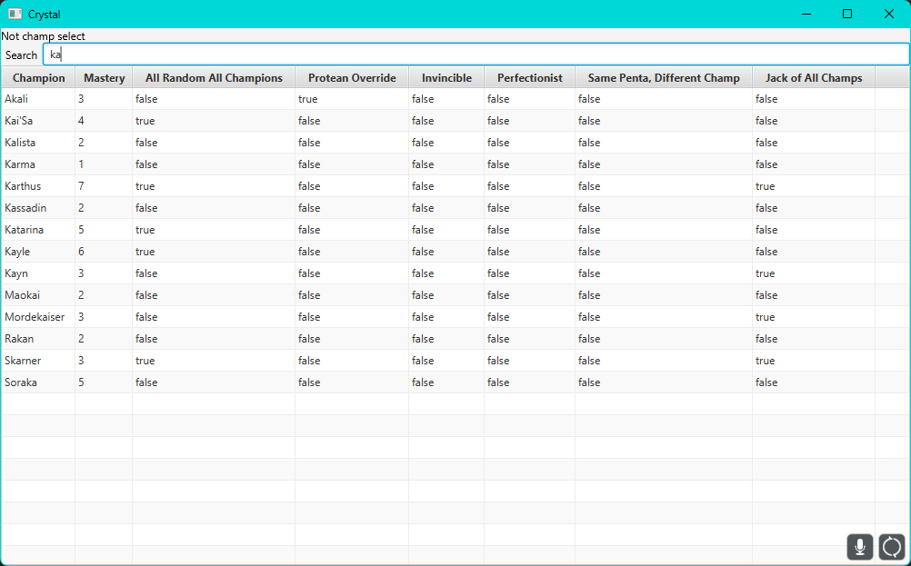

# crystal
i thought i already had a readme but i guess not

application that keeps track of your progress on league challenges that require you to do something per champion

### todo
- [ ] find out how to use riotgames.pem for the websocket listener
- [ ] split lcu manager and ui into separate classes
- [ ] add colors / good separation for current champ list
- [ ] add way to monitor lockfile to see if league is open and automatically re-bind to client
- [x] refresh button